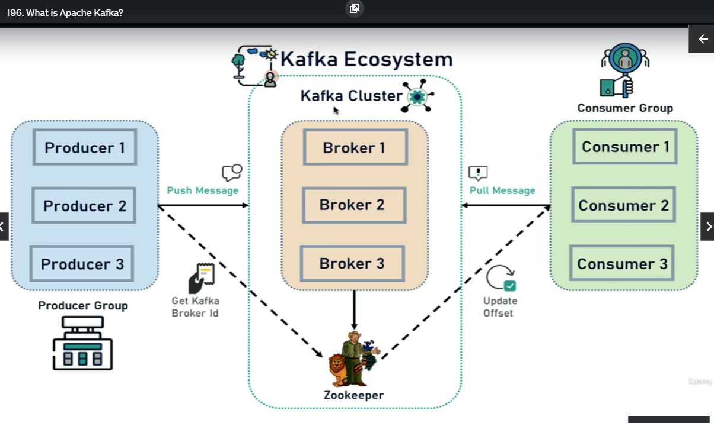

Inside of kafka folder run cmd and these commands windows specific:

# (start zookeeper)
>.\bin\windows\zookeeper-server-start.bat .\config\zookeeper.properties

# (start kafka server)
>.\bin\windows\kafka-server-start.bat .\config\server.properties

# (create a topic to store events)
>.\bin\windows\kafka-topics.bat --create --topic topic-example --bootstrap-server localhost:9092

# (create kafka producer and create events)
>.\bin\windows\kafka-console-producer.bat --topic topic-example --bootstrap-server localhost:9092

 write any events and close with ctrl-z

# (create kafka consumer and read events)
>.\bin\windows\kafka-console-consumer.bat --topic topic-example --bootstrap-server localhost:9092

# (to read events we made earlier, we add --from-beginning flag)
>.\bin\windows\kafka-console-consumer.bat --topic topic-example --from-beginning --bootstrap-server localhost:9092

 In the output we should see all events created by producer in the specified topic

